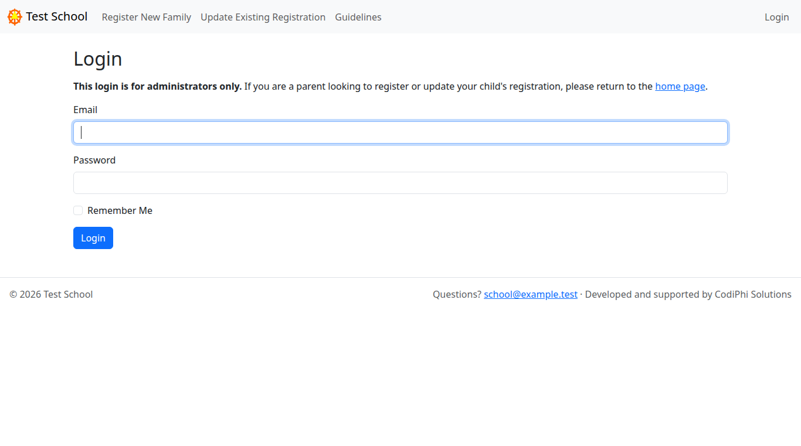
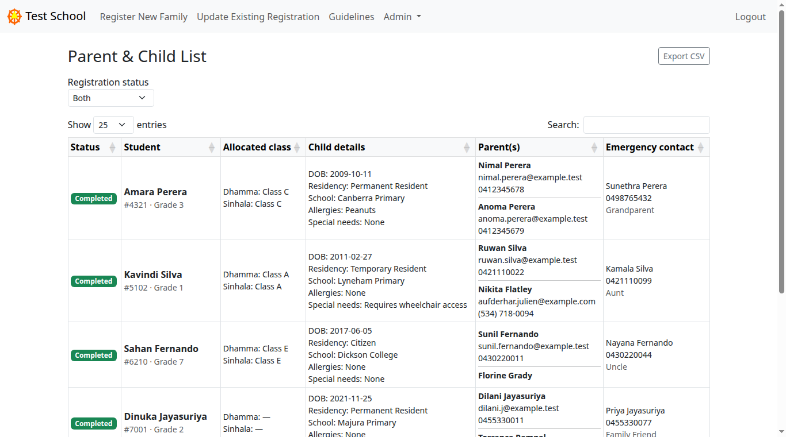
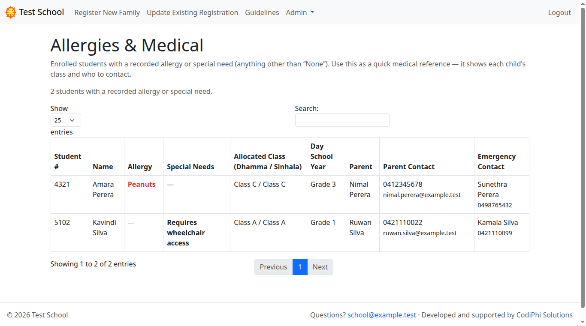
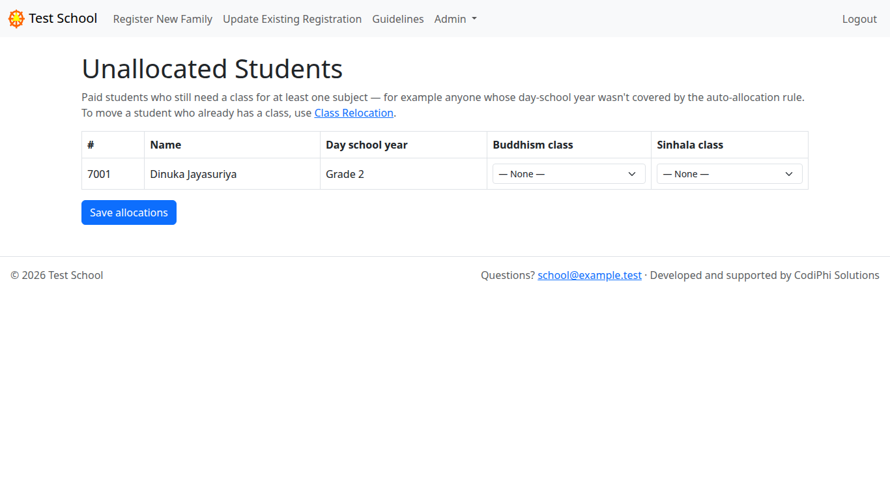
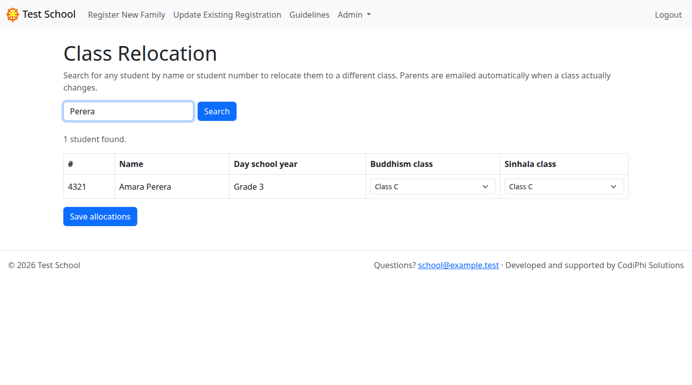
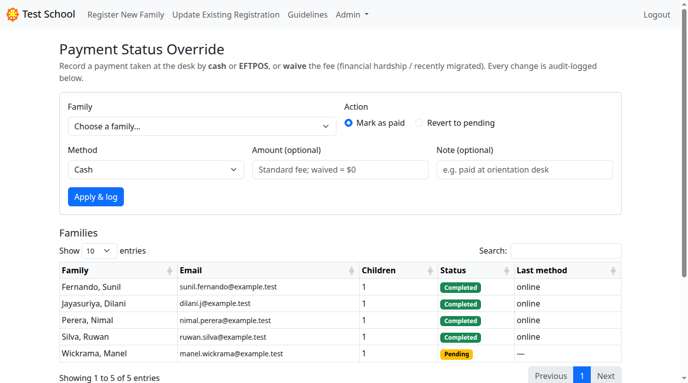
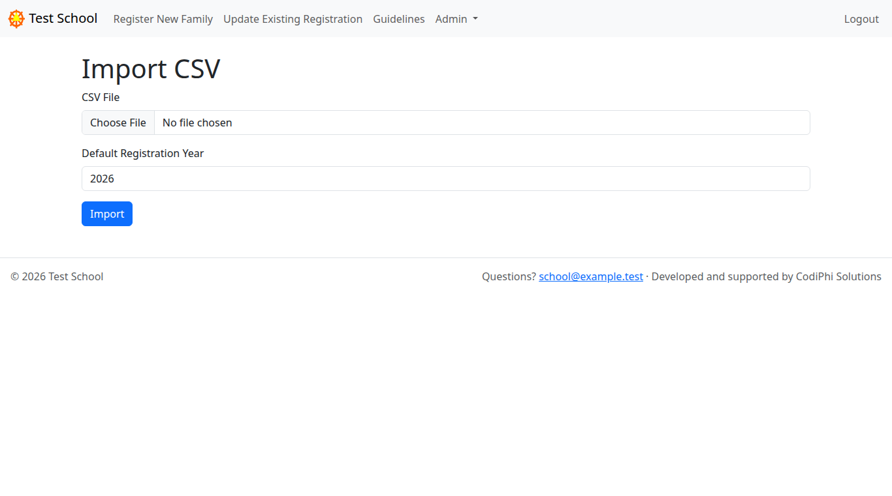

# Admin guide — running the school office

This guide is for **school staff**. It covers logging in and using every page in
the admin area: the family lists, the medical list, class placement, recording
payments taken in person, and importing or exporting data.

Parents don't need any of this — they use the public pages covered in the
[Parent guide](parent-guide.md).

> The screenshots use a demo school called "Test School" with example families.
> Your data will be different.

---

## Contents

- [Logging in](#logging-in)
- [The admin menu](#the-admin-menu)
- [Parents & Child List](#parents--child-list)
- [Allergies & Medical](#allergies--medical)
- [How class placement works](#how-class-placement-works)
- [Unallocated Students](#unallocated-students)
- [Class Relocation](#class-relocation)
- [Payment Override](#payment-override)
- [Import CSV](#import-csv)
- [Export CSV](#export-csv)

---

## Logging in

Admin pages are private. Go to **/login** (or click **Login** in the top-right of
any page) and sign in with your staff email and password.



There is **no self-sign-up** — this login is for administrators only. Staff
accounts are created for you by whoever runs the system (see
[docs/operations.md](../operations.md) for how an account is added). If you've
forgotten your password, ask them to reset it.

Once you're in, an **Admin** menu appears in the top navigation. Click **Logout**
(top-right) when you're finished.

---

## The admin menu

Everything lives under the **Admin** dropdown in the top bar:

| Menu item | What it's for |
|---|---|
| **Parents & Child List** | The master list of every family and child. |
| **Allergies & Medical** | Just the children with an allergy or special need. |
| **Class Relocation** | Search for a student and move them to a different class. |
| **Unallocated Students** | Paid students who still need a class. |
| **Payment Override** | Record a cash/EFTPOS payment, waive a fee, or revert one. |
| **Import CSV** | Bulk-load families from a spreadsheet. |

**Export CSV** isn't in the menu — it's a button on the Parents & Child List
page.

---

## Parents & Child List

**Admin → Parents & Child List.** This is your master list: one row per child,
with the family's full details.



Each row shows the child's **status** (Completed or Pending), their student
number and grade, their **allocated class** for Buddhism and Sinhala, the child's
details (including allergies and special needs), both parents' contact details,
and the emergency contact.

- **Registration status** filter (top-left) — narrow the list to **Completed
  only** (paid) or **Pending only** (not yet paid), or show **Both**.
- **Search** box — type any name, email, or number to filter instantly.
- **Export CSV** (top-right) — download the whole list as a spreadsheet (see
  [Export CSV](#export-csv)).

A **Completed** row means the family has paid. A **Pending** row means they
started but haven't paid yet.

---

## Allergies & Medical

**Admin → Allergies & Medical.** A focused, print-friendly list of only the
children who have something medical recorded — anything other than "None".
Children with no allergy or special need are left off, so this is a quick
reference for teachers on the day.



For each child it shows the **allergy** (in red, if there is one), any **special
need**, their **class**, their grade, and who to contact — the parent's phone and
email plus the emergency contact.

---

## How class placement works

When a family pays, each child is automatically placed into a class based on
their day-school grade. The same class is used for both Buddhism and Sinhala to
start with; you can change either one later.

| Day-school grade | Class |
|---|---|
| Pre School, Kindergarten, Grade 1 | Class A |
| Grade 2 | Class B |
| Grade 3, Grade 4 | Class C |
| Grade 5, Grade 6 | Class D |
| Grade 7–12 | Class E |

The parent is emailed their child's class as part of the confirmation. If a
child's grade doesn't fit the table, they're left **unallocated** for you to
place by hand — that's what the next page is for.

---

## Unallocated Students

**Admin → Unallocated Students.** A worklist of **paid** students who still don't
have a class for at least one subject — usually because their grade wasn't
covered by the table above.



Pick a **Buddhism class** and a **Sinhala class** from the dropdowns for each
student, then click **Save allocations**. Once every paid student has a class for
both subjects, this list is empty.

> This page is only for students with **no** class yet. To move a student who
> already has one, use **Class Relocation**.

---

## Class Relocation

**Admin → Class Relocation.** Use this to move a student who is **already
placed** into a different class.



1. Type part of the student's **name** or their **student number** and click
   **Search**.
2. In the results, change their **Buddhism** and/or **Sinhala** class using the
   dropdowns.
3. Click **Save allocations**.

**The parents are emailed automatically** whenever a class actually changes, so
they always know where their child should be. If you save without changing
anything, no email is sent. After saving, a message tells you how many families
were notified.

---

## Payment Override

**Admin → Payment Override.** Use this when a payment doesn't come through the
website — for example a family pays **cash** or by **EFTPOS** at the desk, or you
**waive** the fee. You can also **revert** a payment that was recorded by mistake.



To record a payment:

1. Choose the **Family** from the dropdown.
2. Leave **Action** on **Mark as paid**.
3. Pick the **Method** — **Cash**, **EFTPOS**, or **Waived** (a waived fee
   completes the registration at $0, for hardship or newly-arrived families).
4. Optionally enter an **Amount** and a **Note** (for example, "paid at
   orientation desk").
5. Click **Apply & log**.

The family is marked **Completed** and their children are placed into classes,
exactly as if they'd paid online.

**To revert a payment**, choose the family, select **Revert to pending**, and
apply. This sets the family back to **Pending**, removes the recorded payment,
**and clears their class placement** — which also removes the students from the
attendance system on its next sync. Use this to undo a mistake or a refund.

Below the form, the **Families** table lists every family with their status and
last payment method, and the **Recent overrides** table is an audit log of every
manual change — who did it, when, and any note. These records can't be edited or
deleted, so there's always a clear history.

---

## Import CSV

**Admin → Import CSV.** Bulk-load families from a spreadsheet — handy for
carrying over last year's families or a batch entered offline.



1. Click **Choose File** and pick your `.csv` file.
2. Set the **Default Registration Year** (the year to record for imported
   families).
3. Click **Import**.

Your CSV needs a **header row** with these columns. Parent columns come first:

```
Parent1FirstName, Parent1LastName, Parent1Email, Parent1Phone,
Parent2FirstName, Parent2LastName, Parent2Email, Parent2Phone,
EmergencyContactName, EmergencyContactPhone, RelationshipToFamily, Postcode
```

Then up to **four** children, numbered 1–4. For each child `N`:

```
ChildNFirstName, ChildNLastName, ChildNGender, ChildNDateOfBirth,
ChildNResidencyStatus, ChildNDaySchoolName, ChildNDaySchoolYear,
ChildNAllergies, ChildNSpecialNeeds, ChildNStudentNumber, ChildNPhotographyAllowed
```

A child is only created if their **first name** column has a value, so you can
leave the unused child columns blank. The easiest way to get the column names
exactly right is to **Export CSV** first and use that file as your template.

> Imported families are **not** charged and are **not** auto-placed into classes
> — use [Unallocated Students](#unallocated-students) or
> [Class Relocation](#class-relocation) to place them, and
> [Payment Override](#payment-override) if you need to mark them paid.

---

## Export CSV

On the **Parents & Child List** page, click **Export CSV** (top-right) to
download every family and child as a spreadsheet — one row per child, including
their allocated Buddhism and Sinhala classes. Open it in Excel or Google Sheets
for reporting, or keep it as a backup / import template.
