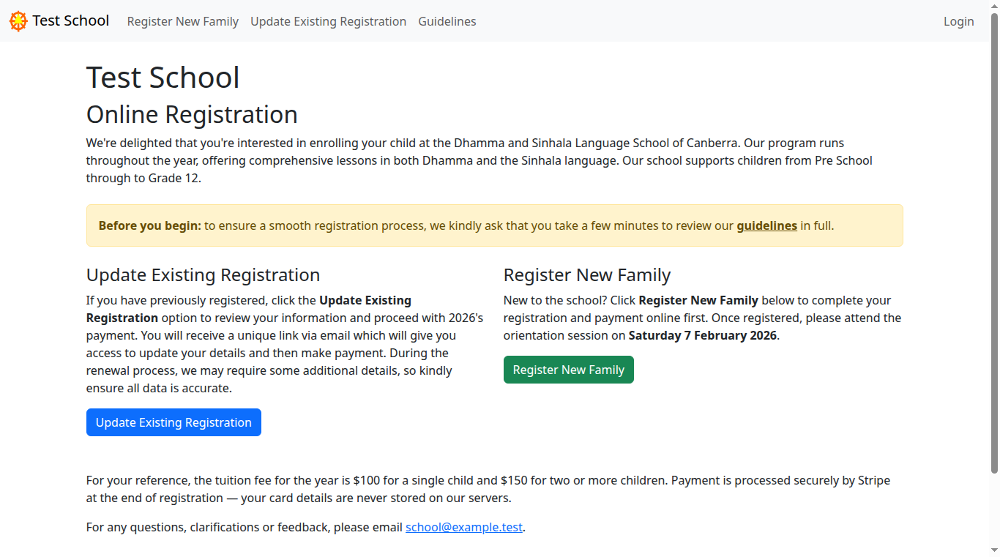
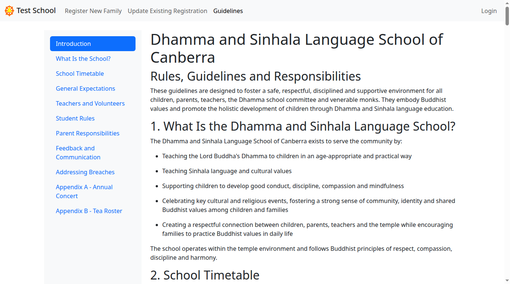
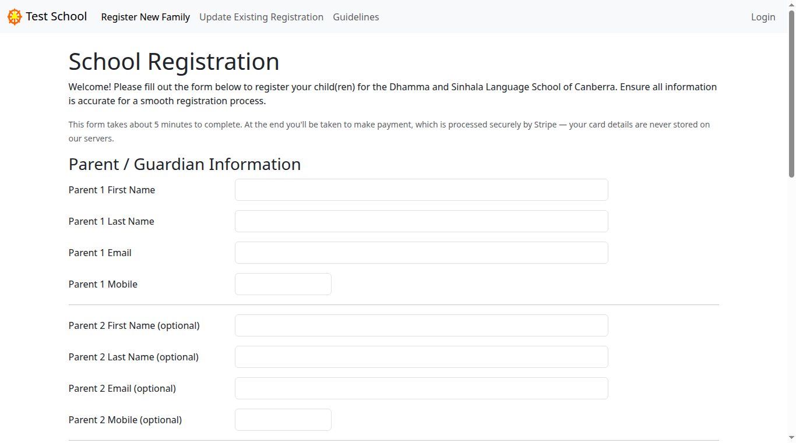
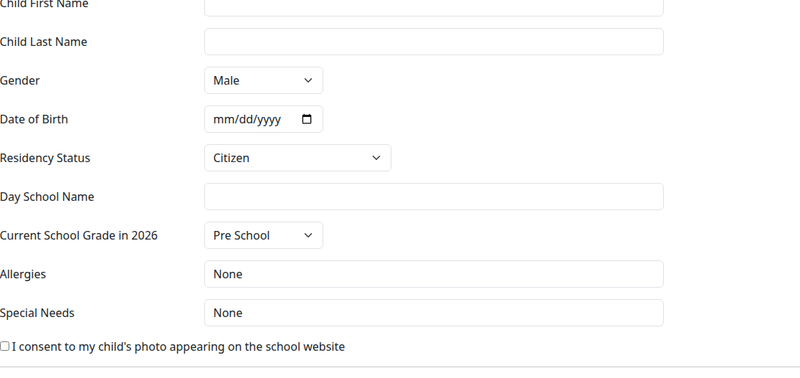
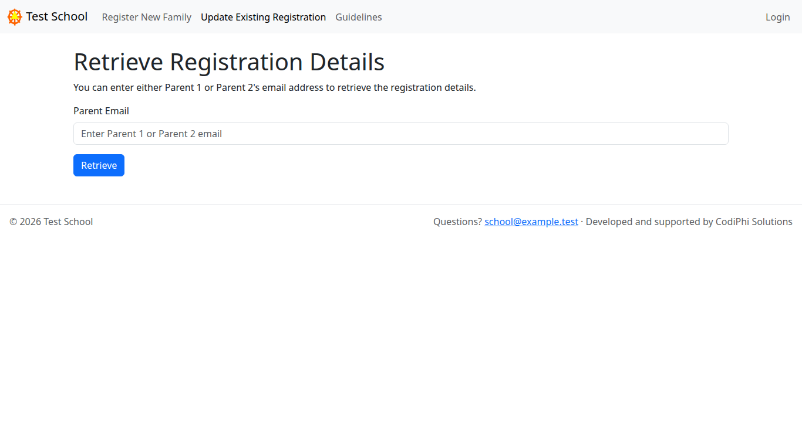
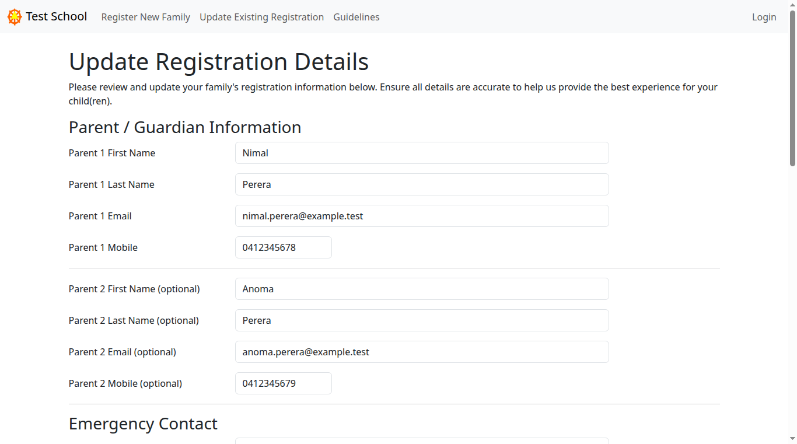
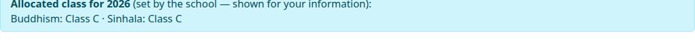

# Parent guide — registering and paying

This guide is for **parents and guardians**. It walks you through enrolling your
child, paying, and later updating your details. No account or password is
needed — everything is done from the links on the home page and a secure link we
email you.

If you are a member of school staff, see the
[Admin guide](admin-guide.md) instead.

> The screenshots below use a demo school called "Test School" with example
> names. Your school's name, fees, and dates will be different.

---

## Contents

- [Before you start](#before-you-start)
- [Register a new family](#register-a-new-family)
- ["It looks like you're already registered"](#it-looks-like-youre-already-registered)
- [Get your update link](#get-your-update-link)
- [Update your details](#update-your-details)
- [What it costs](#what-it-costs)
- [Getting help](#getting-help)

---

## Before you start

Open the school's registration website. You'll land on the home page.

There are two choices:

- **Register New Family** — you are enrolling for the first time.
- **Update Existing Registration** — you have registered before and want to
  renew or change your details.

Before registering, please read the **Guidelines**. They explain the timetable,
what's expected of students and parents, and how classes are grouped. You'll be
asked to tick a box confirming you've read them.

---

## Register a new family

Click **Register New Family** on the home page. The form takes about five
minutes and ends with an online card payment.

### 1. Your details

Fill in **Parent / Guardian Information**:

- **Parent 1** — first name, last name, email, and mobile are all required. This
  is the email we'll use to send your confirmation and any future update links,
  so make sure it's correct.
- **Parent 2** is optional. If you add a Parent 2 email, they'll also get the
  emails.
- **Emergency Contact** — a name, phone number, and their relationship to your
  family (for example, "Grandparent").

### 2. Add your children

Scroll down to the **Children** section. For each child you enter their name,
gender, date of birth, residency status, day-school name, and their current
school grade.

- **Allergies** and **Special Needs** start as **None**. If your child has an
  allergy or a special need we should know about, replace "None" with the
  details. If there's nothing to report, leave it as **None**.
- Tick the **photography consent** box if you're happy for your child's photo to
  appear on the school website. Leave it unticked if not.

To enrol more than one child, click **+ Add Another Child** at the bottom — a new
blank child section appears. **- Remove Last Child** removes the most recently
added one.

### 3. Accept the guidelines and register

Tick **I accept the school guidelines**, then click **Register**.

### 4. Pay

You're taken to a secure **Stripe** payment page to pay by card. The school
never sees or stores your card details. When the payment succeeds you're brought
back to a **Registration Complete** page.

### 5. Check your email

We email a confirmation to Parent 1 (and Parent 2, if you added one). The email
includes the **class your child has been placed in** for the year. Keep this
email — you don't need it to log in, but it's a handy record.

> **Didn't get the email?** Check your spam or junk folder first. If it's still
> missing after a few minutes, contact the school (see
> [Getting help](#getting-help)).

---

## "It looks like you're already registered"

If you start a new registration with an email we already have on file, we won't
create a duplicate. Instead we send you a secure link to update your existing
registration and show a message explaining this. Just check your email and
follow the link — see [Update your details](#update-your-details) below.

---

## Get your update link

To renew for a new year or change anything about an existing registration, you
need a secure update link. You don't have a password — we email the link to you
each time.

1. On the home page, click **Update Existing Registration**.
2. Enter the email you registered with (Parent 1 **or** Parent 2 works).

3. Click **Retrieve**. We email a secure link to update your details.

> The link is **temporary** — it expires after a few hours for your security. If
> yours has expired, just request a new one the same way. Always use the link in
> the **most recent** email.

---

## Update your details

Open the link from the email. You'll see the same form as registration, but
already filled in with your details.

You can change any of your information, add a new child, or remove a child who is
no longer enrolling. Editing works exactly like the registration form.

**One thing you can't change:** each child shows the **class the school has
placed them in**. This is shown for your information only — it's set by the
school, so there's no box to edit it.

When you're done, click **Update Registration** at the bottom.

- If you had **already paid**, your changes are saved straight away.
- If your registration **hadn't been paid yet**, you'll be taken to the payment
  page to finish.

---

## What it costs

The fee for the year is shown on the home page — it's a single price for one
child and a slightly higher price for two or more children. Payment is by card
through Stripe at the end of registration.

---

## Getting help

If you're stuck at any point, contact the school using the email address shown
in the footer of every page (and in your confirmation email). Include your name
and your child's name so we can find your registration quickly.
